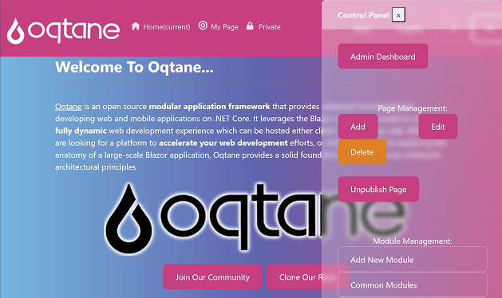
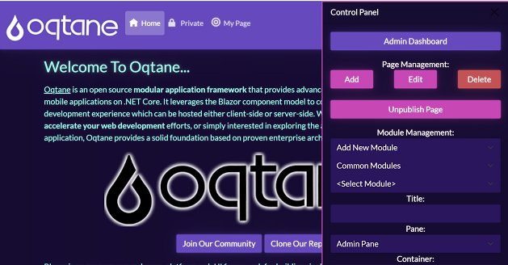
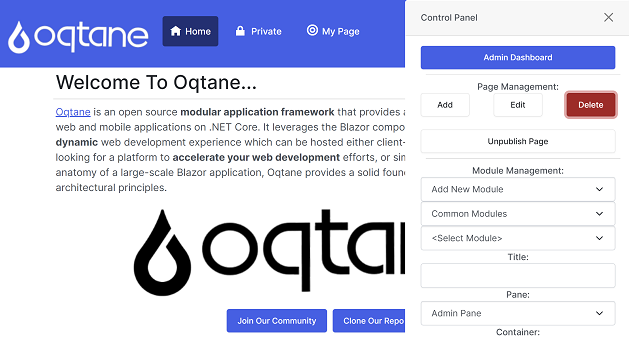

# Latest Release

[6.1.6](https://github.com/oqtane/oqtane.theme.bootswatch/releases/tag/v6.1.6) was released on Sep 18, 2025.

# Oqtane Bootswatch Theme Collection

These themes are based on Bootswatch \- https://bootswatch.com/

A custom theme is comprised of razor components \- some which inherit from ThemeBase \(theme components\) and ContainerBase \(container components\).

Theme components are the structure and layout for your pages\. They include embedded theme controls such as Menu, Login, etc\.\.\. Theme components must contain Pane components which indicate locations where modules will be dynamically injected at runtime\.

Container components are containers for individual module instances\. They include embedded container controls such as ModuleActions, ModuleTitle, etc\.\.\. Container components must contain a ModuleInstance component which is where the module output will be dynamically rendered at runtime\.

Themes contain an implementation of the ITheme interface which provides metadata about the theme\.

Themes have static resources such as images or CSS files which will be located in the wwwroot folder with a subfolder name matching the theme name\.

These themes utilize inheritance so that the razor components for each individual theme all inherit from the Default theme\. This consolidates all of the HTML markup within a minimal number of components to simplify maintenance.

A sample of what the various themes look like is shown below:

### Cerulean

### Cosmo

### Darkly

### Default

### Flatly

### Journal

### Litera

### Lumen

### Lux

### Materia

### Minty

### Morph

### Pulse

### Quartz

### Sandstone

### Simplex

### Sketchy

### Slate

### Solar

### Spacelab

### Superhero

### United

### Vapor

### Yeti

### Zephyr

