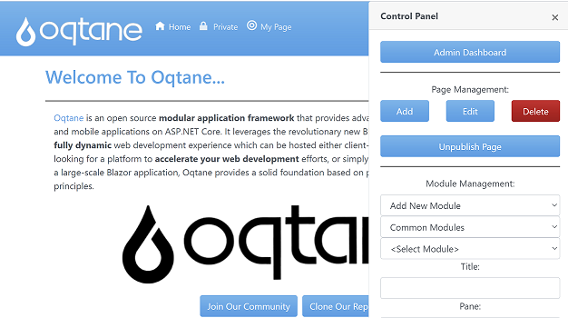
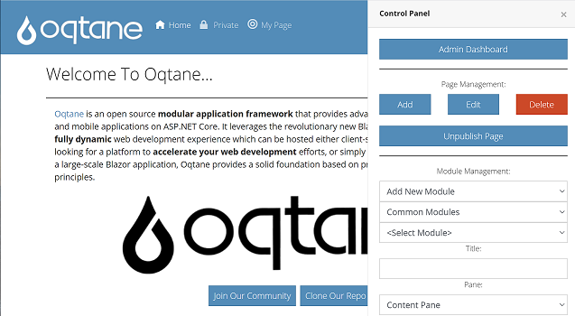

# Oqtane Bootswatch Theme

Oqtane allows developers to create themes which are rendered by the framework dynamically at run\-time. 

These themes are based on Bootswatch \- https://bootswatch.com/

A custom theme is comprised of razor components \- some which inherit from ThemeBase \(theme components\), some from ContainerBase \(container components\) and some from LayoutBase \(layout components\)\.

These set of themes have been build by such that the default theme inherits these ThemeBase, ContainerBase, and LayoutBase components and all other themes inherit from the Default theme\.

Theme components are the structure and layout for your pages\. They include embedded theme controls such as Menu, Login, etc\.\.\. Theme components must contain Pane components which indicate locations where modules will be dynamically injected at runtime\.

Container components are containers for individual module instances\. They include embedded container controls such as ModuleActions, ModuleTitle, etc\.\.\. Container components must contain a ModuleInstance component which is where the module output will be dynamically rendered at runtime\.

Themes can optionally contain an implementation of the ITheme interface which provides metadata about the theme\.

Themes may have static resources such as images or CSS files which will be located in the wwwroot folder with a subfolder name matching the theme name\.

A sample of what the various themes look like is shown below:

### Cerulean

### Cosmo

### Darkly

### Default

### Flatly

### Journal

### Litera

### Lumen

### Lux

### Materia

### Minty

### Pulse

### Sandstone

### Simplex

### Sketchy

### Slate

### Solar

### Spacelab

### Superhero

### United

### Yeti

